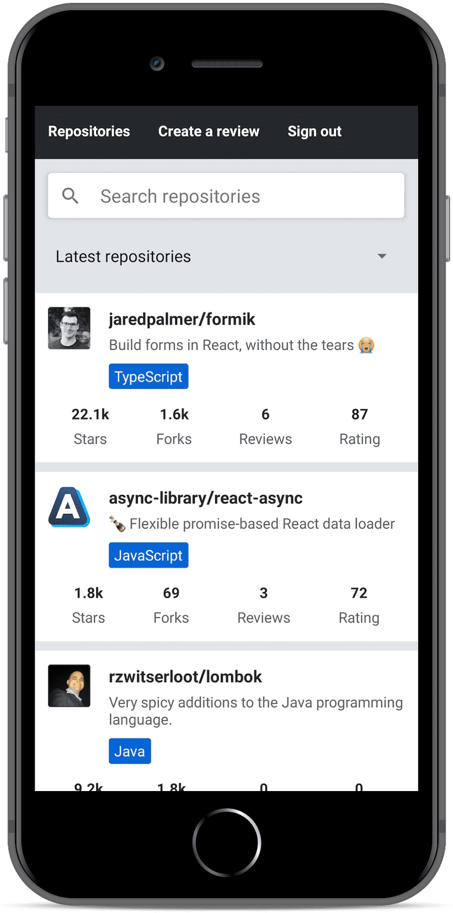

# Rate-repository-app
Learning React Native by  developing an application for rating GitHub repositories. Our application will have features such as, sorting and filtering reviewed repositories, registering a user, logging in and creating a review for a repository.

 - Learn how to build an actual React Native application from bottom up. 
 - Learn concepts such as what are React Native's core components, how to create beautiful user interfaces, how to communicate with a server and how to test a React Native application.

The final version of our application will look something like this:

